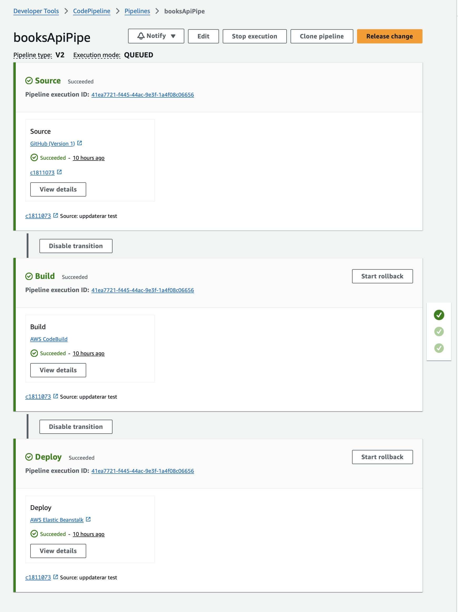

# Projekt - Book API

Projektet hostas på AWS. För detta används tjänsten Elastic Beanstalk som plattform och EC2 som server. I projektet ingår en CI/CD-pipeline som bygger och distribuerar projektet automatiskt vid push eller pull request till main-branchen på GitHub. Översikt:



Pipelinen startas av en GitHub App som meddelar AWS CodePipeline när en ny push eller pull request har skett i repot. CodePipeline hämtar sedan koden från GitHub-repot, bygger projektet, paketerar det och distribuerar det till en Elastic Beanstalk-miljö på AWS som gör programmet tillgängligt via HTTP. För att fungera behöver byggprocessen en service-roll som jag givit följande Permission policies:

* AWSCodeBuildDeveloperAccess
* CodeBuild-CloudWatchLogs-Access-Policy
* CodeBuildBasePolicy-bookApiBuild-eu-north-1
* CodeBuildCodeConnectionsSourceCredentialsPolicy-bookApiBuild-eu-north-1

Den andra policyn har jag fåt skriva själv:
```JSON
{
	"Version": "2012-10-17",
	"Statement": [
		{
			"Sid": "VisualEditor0",
			"Effect": "Allow",
			"Action": [
				"logs:CreateLogStream",
				"logs:PutLogEvents"
			],
			"Resource": "arn:aws:logs:eu-north-1:273354644831:log-group:/aws/codebuild/*:log-stream:*"
		},
		{
			"Sid": "VisualEditor1",
			"Effect": "Allow",
			"Action": "logs:CreateLogGroup",
			"Resource": "arn:aws:logs:eu-north-1:273354644831:log-group:/aws/codebuild/*"
		}
	]
}
```
Policyn ger skrivbehörighet till loggrupper och logstreams för CodeBuild. Utan den är det nästan omöjligt att felsöka.

Byggskriptet i CodeBuild ser ut så här (med förklarande kommentarer:
```yaml
version: 0.2
phases:
  install: # Installationsfasen sätter upp miljön
    runtime-versions:
      java: corretto21 # Anger JDK till Corretto 21
  pre_build: #fas före själva bygget, används inte här, skriver bara ut ett meddelande
    commands:
      - echo Nothing to do in the pre_build phase... 
      build: #byggfasten
    commands:
      - echo Build started on {date} # Meddelande om datum 
      - mvn install # Kör Maven-installationen
      - mvn clean package # 
  post_build: #Efterbyggsfasen, används inte här, skriver bara ut ett meddelande
    commands:
      - echo Build completed on {date}
artifacts:
  files:
    - target/*.jar # Anger att jar-filen ska skickas till Elastic Beanstalk
  discard-paths: yes # Tar bort sökvägen till jar-filen
```
Programmet använder en MySQL-databas i AWS RDS. Inloggningen sker med miljövariabler som ligger i IntelliJ, på GitHub och i Elastic Beanstalk-miljön.
